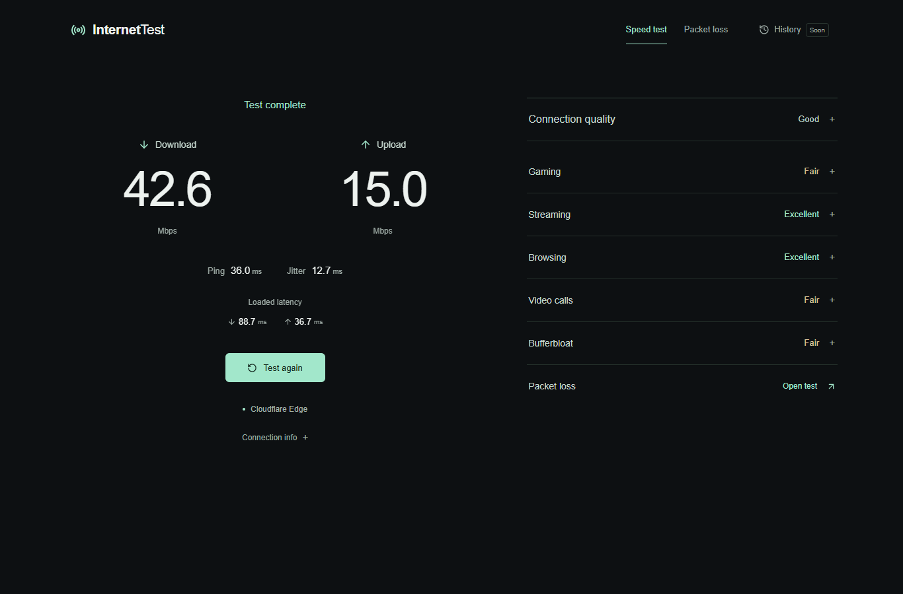
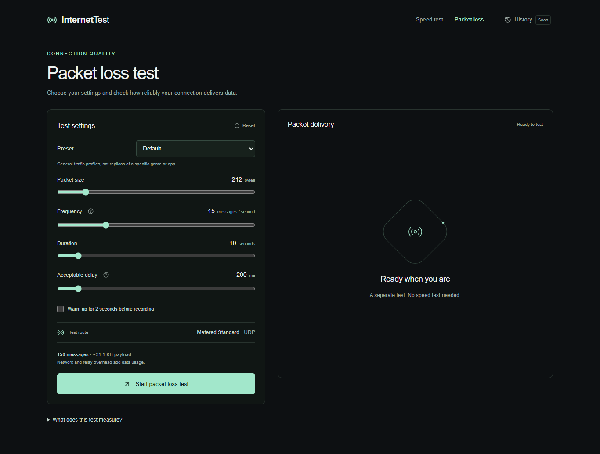
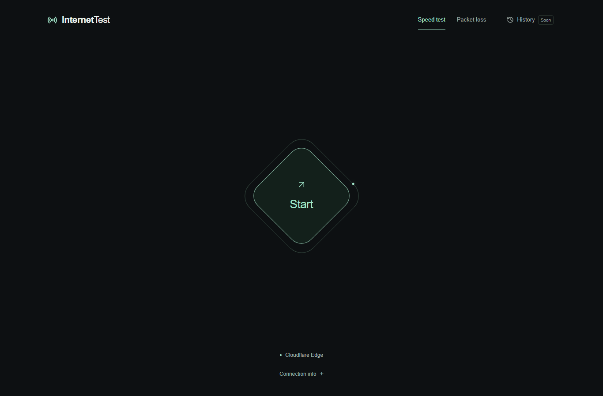

# InternetTest

Check how fast your internet is—and how well it handles everyday use. InternetTest combines a browser-based speed test, connection-quality analysis, and an independent packet-loss test in a responsive interface.

**[Try the live demo](https://internettest-ruby.vercel.app/)** · **[Open the packet-loss test](https://internettest-ruby.vercel.app/packet-loss)**



_Screenshot from the local production app displaying a saved sample run. Your results will depend on your connection._

## Features

| Test                   | What you get                                                                                                                    |
| ---------------------- | ------------------------------------------------------------------------------------------------------------------------------- |
| **Internet speed**     | Download/upload speed, ping, jitter, and latency during transfers, with smooth live readings.                                   |
| **Connection quality** | Suitability ratings for gaming, streaming, browsing, and video calls, plus bufferbloat analysis and expandable explanations.    |
| **Packet loss**        | Sent, received, lost, and late messages; loss/lateness percentages; average delivery delay, delay jitter, and a delivery chart. |

- Run speed and packet-loss tests independently, in either order.
- Choose **Quick, Default, Gaming, Voice call, Video call, or Stability** presets, or adjust the settings yourself.
- Configure payload size, frequency, duration, acceptable delay, and optional warm-up.
- Cancel tests, reset settings, and export packet-loss results as dated **CSV/JSON** files.
- Use either page on desktop or mobile, with keyboard-accessible controls and status feedback.

History is marked **Soon** and disabled. Gaming ratings describe general connection suitability; they do not measure actual game-server ping.

## Screenshots

### Packet-loss settings



_No speed test is required before using this page._

<details>
<summary>Speed-test start screen</summary>



</details>

Screenshots were captured locally from the actual app. No new bandwidth or TURN measurements were run to create them.

## How it works

**Speed:** [Cloudflare's speedtest library](https://github.com/cloudflare/speedtest) transfers data directly between your browser and Cloudflare infrastructure. Tests start manually; final readings use provider aggregates, while animation smooths the display. A complete run can request about **117 MB** of payload, plus overhead. Idle ping is HTTP timing, not ICMP.

**Connection quality:** speed, latency, jitter, and loaded latency help explain likely performance for common activities. Bufferbloat analysis compares idle and loaded latency. Missing measurements remain unavailable.

**Packet loss:** two peers in your browser exchange numbered, unordered WebRTC messages through **Metered Standard TURN over verified UDP**, with retransmission disabled. Optional 2-second warm-up messages are excluded, followed by a final receive window of up to 5 seconds. Unverified transport or no deliveries produces an unavailable result.

<details>
<summary>Understanding packet-loss results</summary>

- **Loss:** unique sent messages that do not arrive within the receive window. Loss percentage is `(sent - received) / sent × 100`.
- **Late:** received messages exceeding your **acceptable delay** threshold. A late message is still received and is not also lost. Late percentage uses all recorded messages as its denominator.
- **Average delay:** mean delivery delay of received messages, measured with the same browser clock.
- **Delay jitter:** mean absolute delay change between successive received messages in sequence order.

This measures relay message delivery on one route, rather than raw ICMP, exact wire-packet loss, echo-server RTT, or separate upload/download loss.

</details>

## Run locally

You need **Node.js 24.x** and **pnpm 11.19.0**.

```sh
git clone https://github.com/notAnKy/internettest.git
cd internettest
pnpm install --frozen-lockfile
pnpm dev
```

Open [localhost:3000](http://localhost:3000). **Speed testing works without environment variables.** Packet-loss testing requires Metered setup below.

If pnpm is unavailable, replace it with `npx --yes pnpm@11.19.0`. After installing dependencies, `npm run dev` also works.

### Enable packet-loss testing

Copy [.env.example](.env.example) to `.env.local` and fill in these server-side values:

```dotenv
METERED_APP_NAME=your_app_name
METERED_TURN_API_KEY=your_credential_api_key
```

| Variable               | Where to find it                                                                                 |
| ---------------------- | ------------------------------------------------------------------------------------------------ |
| `METERED_APP_NAME`     | Your app prefix or full `<app>.metered.live` domain, under **Developers**.                       |
| `METERED_TURN_API_KEY` | Credential-specific API key under **TURN Server → Credentials → Get credential → Show API Key**. |

Create a TURN credential in the [Metered dashboard](https://dashboard.metered.ca/v2) first. Use its credential-specific key rather than the account-wide Developers Secret key. Allow up to two minutes for propagation, then restart the local server. See [Metered's quickstart](https://www.metered.ca/docs/turn-server-service/quickstart/).

### Development commands

| Command             | Purpose                                                                         |
| ------------------- | ------------------------------------------------------------------------------- |
| `pnpm dev`          | Development server.                                                             |
| `pnpm test`         | Deterministic unit tests without real network measurements.                     |
| `pnpm lint`         | ESLint checks.                                                                  |
| `pnpm typecheck`    | TypeScript checks.                                                              |
| `pnpm build`        | Production build.                                                               |
| `pnpm start`        | Serve the production build.                                                     |
| `pnpm test:release` | Units, lint, typecheck, build, security scans, and desktop/mobile smoke checks. |

The release check uses synthetic secret canaries and mocked WebRTC, blocks external speed traffic, and owns/stops its preview server. It never uses live TURN credentials or writes screenshot reports on success. On Windows it uses installed Edge; elsewhere, install Chromium with `pnpm exec playwright install chromium`. `BROWSER_CHANNEL` is an optional QA setting.

## Security and usage limits

- Local environment files, builds, traces, and QA artifacts are ignored. Commit only the placeholder `.env.example`; never prefix Metered variables with `NEXT_PUBLIC_`.
- The credential API returns a setup boolean on GET. Credentials require a same-origin POST with validated settings, a **1 KiB** body limit, an **8-second** timeout, no-store responses, and safe errors. It returns only the required UDP ICE configuration.
- The API key stays server-side. WebRTC necessarily receives runtime TURN usernames/passwords in the browser. These are existing Metered credentials, not newly minted short-lived credentials; rotate or revoke them through Metered.
- Exports contain diagnostic fields/settings only, excluding credentials and ICE configuration.

Packet-loss limits are **64–1,200-byte payloads**, **1–60 messages/second**, **5–60 seconds**, **1,800 recorded messages**, **1,920 total messages including warm-up**, and **1 MiB application payload including warm-up**. Protocol/relay overhead adds usage. Both the client and credential endpoint validate settings.

These bounds cannot prevent deliberate TURN credential reuse or forged non-browser requests. Use Metered quota controls and revocation; consider persistent [Vercel WAF rate limiting](https://vercel.com/docs/vercel-firewall/vercel-waf/rate-limiting) for public traffic, subject to your plan. An endpoint limit cannot stop reused credentials. Use the allowance shown in your Metered dashboard.

## Limitations and data

- Browser timing, background tabs, Wi-Fi, VPNs, and competing traffic affect results. Keep the tab active during tests.
- Loaded latency may be unavailable when transfers are short or browser timing is restricted.
- Packet loss tests one Standard relay route, without a selectable city list. Zero observed loss is a short sample, not a long-term guarantee.
- Cloudflare/Metered availability, TURN quota, UDP access, and browser relay statistics are external dependencies.
- The latest speed result is stored locally in your browser. Packet-loss results and credentials are not persisted by the app; exports stay where you save them.
- Vercel Analytics collects visits/page views; Speed Insights collects website performance metrics, separately from the internet speed test. The app sends no custom diagnostic-result events or TURN credentials to either SDK. Content blockers can prevent collection.

## Deploy to Vercel

Import your repository using the [Next.js preset](https://vercel.com/docs/frameworks/nextjs), **Node.js 24.x**, and repository root:

| Setting          | Value                                              |
| ---------------- | -------------------------------------------------- |
| Install command  | `npx --yes pnpm@11.19.0 install --frozen-lockfile` |
| Build command    | `npm run build`                                    |
| Output directory | Next.js default                                    |

For packet loss, add **only `METERED_APP_NAME` and `METERED_TURN_API_KEY`** to the Production environment. Preview deployments need them only if they should support packet loss. Treat the key as sensitive and redeploy after changing variables.

The credential route runs as a Node.js function; WebRTC measurements run in the browser. Both `/` and `/packet-loss` support direct visits and refreshes. A static-only export cannot serve the credential endpoint.

The [Analytics](https://vercel.com/docs/analytics/quickstart) and [Speed Insights](https://vercel.com/docs/speed-insights/quickstart) SDKs are included. Enable the dashboard features, deploy, and visit both pages to begin collecting data. Neither requires extra environment variables.

## Built with

Next.js App Router · React · TypeScript · Tailwind CSS · Lucide React · Cloudflare speedtest · Metered TURN · Vercel Analytics / Speed Insights

ESLint, Prettier, and Playwright support development and verification. Dependency versions are recorded in [package.json](package.json) and [pnpm-lock.yaml](pnpm-lock.yaml).

## License

InternetTest's original code is [MIT licensed](LICENSE). Adapted Cloudflare logic retains its original MIT notice. See [third-party notices](THIRD_PARTY_NOTICES.md) for attribution and [full permission notices](public/third-party-notices.txt).
